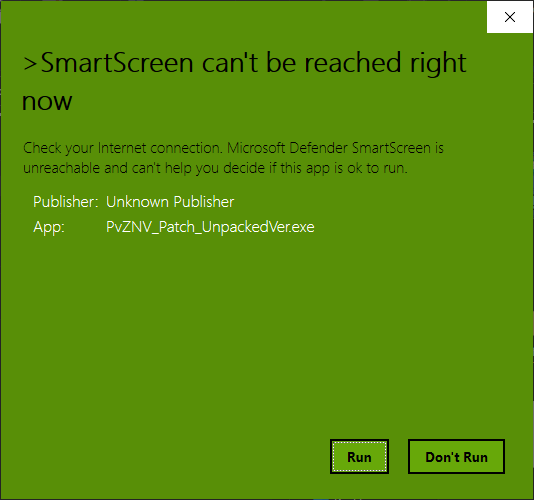

# About this mod

Plants vs. Zombies NoVariant (formerly PvZ Advanced)
Start development date: August 1st 2023

This mod has been inspired from the famous Plants vs. Zombies beta mod. 
Featuring buffed zombies, buffed plants, this mod will attempt to bring a new type of challenge to the average Plants vs. Zombies mods player.

## Featuring
- Buffed zombie health and abilities 
- Buffed plants with new abilities
- A new stage 6 with new challenges
- New gameplay balancing!
- A new copyright friendly way of mod installation
- Keyboard hotkeys!

Full list of changes to the game can be found on the PDF file on the patch.

# Releases
Coming soon.

# Install Instructions
1. Have a vanilla copy of the OG Version (1.0.1051) of Plants vs. Zombies ready.
2. Download the patch from here.
3. Run the patch. If you see this screen: 

	 
	Then just click on Run. This issue happens because there is no certification on the patch executable. It is safe to run.
4. Set the install location on the patch to the vanilla copy of OG on step 1.
5. Install.
6. Run "PlantsVsZombiesNoVariant.exe" and enjoy!
	
# Difference between Unpacked and Packed versions
Unpacked version of the game looks like this:

While packed version looks like this:

Download the appropriate patch for the appropriate version of the game. Other than that, **there are no difference in both of the versions**.

# Credits
## Scripts
Ayban, Keifer, Siku-chan, Bayant白蚁, 2G70大魔王, marcwu531 et al.\
If you have not been credited, please create a Github issue on this repository.

## Visuals
Keifer for the Autumn Leaf texture

## Custom OST (for the Custom BGM Version)
虽花 (except for CYS which is Neon Mixtape (idk how to credit that one I'm sorry))

## Special Thanks
Bayant for script assistance and providence. Without him this mod would not have been completed.
